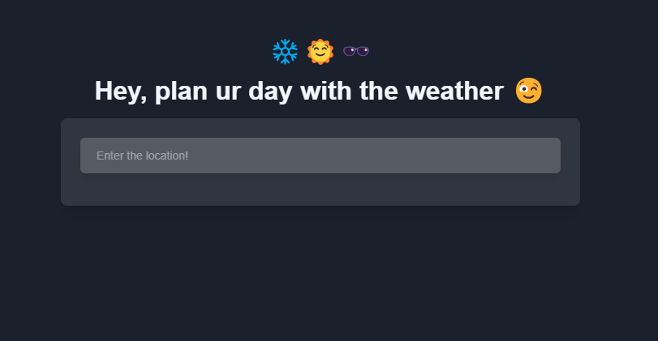
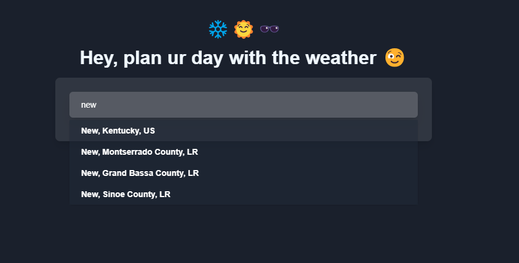
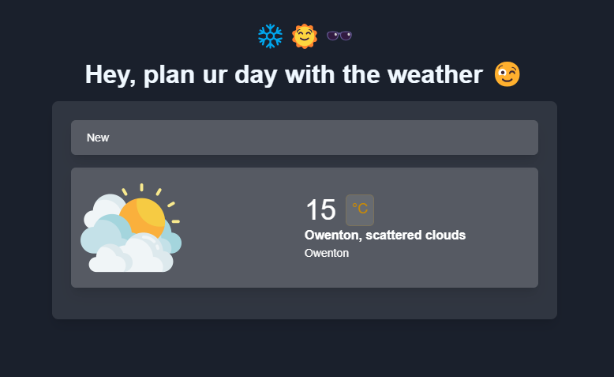

# Weather App

This is a responsive weather application built with Angular 17. It provides users with real-time weather information for any specified location or the user's current location. The app leverages Angular signals and RxJS to efficiently manage state and asynchronous data, delivering smooth performance and real-time updates.

## Screenshots


*Home screen showing current weather details*


*Search feature with auto complete*


*Search feature with weather details for a specified city*

## Features

- **Real-time Weather**: Displays current weather conditions, including temperature, humidity, and wind speed.
- **City Search**: Users can search for weather information by city name.
- **Location-based Weather**: Fetches weather data based on the user's current location (with permission).
- **5-Day Forecast**: Shows weather forecasts for the next five days.
- **Dark Theme Support**: Toggle between light and dark themes with Tailwind CSS.
- **Reactive UI**: Uses Angular signals and RxJS to manage real-time data updates and state changes.

## Technologies Used

- **Angular 17**: Core framework for building this single-page application.
- **Signals**: Angular's reactive primitive for managing state within the app.
- **RxJS**: Enables handling of asynchronous data streams, particularly for API requests and real-time updates.
- **Tailwind CSS**: Provides styling with a utility-first approach for responsive design.
- **Weather API**: Fetches real-time weather data from an external weather provider (e.g., OpenWeatherMap).

## Prerequisites

- **Node.js**: v18.x or later
- **Angular CLI**: v17.x
- **Weather API Key**: API key from a weather provider.

## Live

1. Visit the live app:

   ```bash
        https://my-weather-app-alpha-six.vercel.app/home


## Installation

1. Clone the repository:

   ```bash
   git clone https://github.com/yourusername/weather-app.git
   cd weather-app
